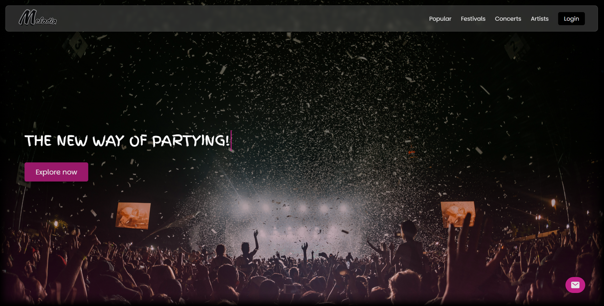

# 🎵 Melodia  

Melodia is a music platform designed to help users discover festivals, concerts, and artists. It provides an intuitive and visually appealing experience for music lovers, making staying connected to the music scene easy.  

## Deployment  

Deployed Website: [https://melodia-athtech.netlify.app](https://melodia-athtech.netlify.app)  

[](https://melodia-athtech.netlify.app)

## Website Features

- **Homepage**: Entry point with an overview of festivals and key sections.  
- **Popular Section**: Highlights trending festivals and concerts.  
- **Festivals & Concerts Pages**: Detailed information about various events.  
- **Artists Section**: Showcases profiles of featured artists.  
- **Footer Links**:  
  - Contact Us  
  - FAQ  
  - About Melodia  
  - Help Center  
  - Blog  
  - Terms of Service  
  - Careers  

## Contribution  

This project was developed by:  

- **Stergios Fotoglou**: Homepage layout, navigation, footer, "Popular" page, and "Artists" page.  
- **Panagiotis Chologkitas**: "Sign In", "Contact Us", and specific details on concert/festival pages.  
- **Lefteris Kyriakakis**: "Terms of Service", "Blog", and specific details in festival pages.  
- **Grigoris Grigoropoulos**: "FAQ" and specific details on concert/festival pages.  
- **Tryfonas Gavrilis**: "Help Center", "About Melodia", "Careers", and specific details on event pages.  

## Built With  

- [HTML](https://developer.mozilla.org/en-US/docs/Web/HTML)  
- [CSS](https://developer.mozilla.org/en-US/docs/Web/CSS)  
- [JavaScript](https://developer.mozilla.org/en-US/docs/Web/JavaScript)  

## Getting Started  

To start the project, fork this repository or download it locally on your System.

### Steps to Run Locally  

1. Clone the repository:  
```sh
   git clone https://github.com/your-username/melodia.git  
   cd melodia
```
